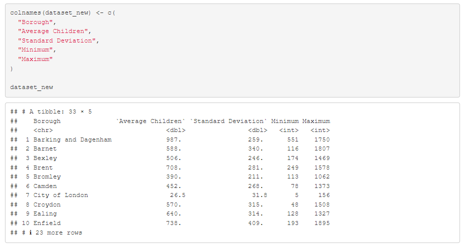
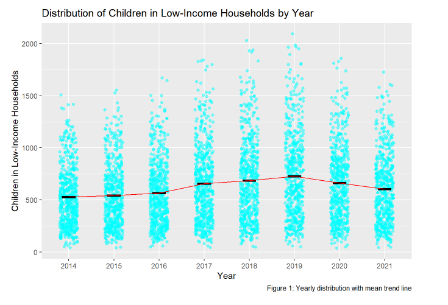
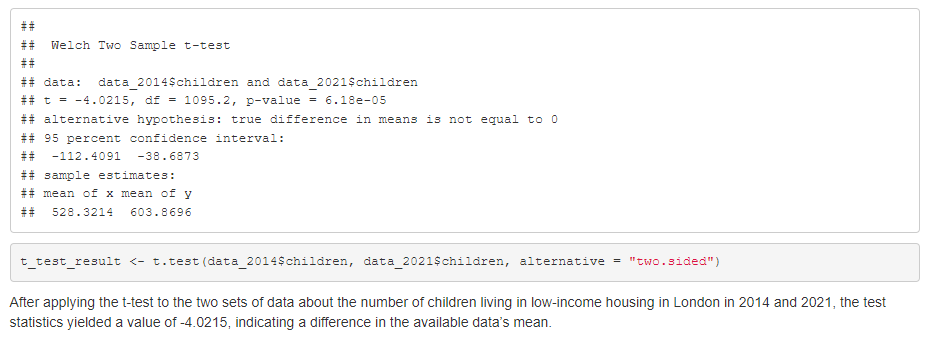

# london-low-income-household-analysis
London Low-Income Household Analysis
Overview

This project analyses children living in low-income households across London boroughs between 2014 and 2021. The analysis uses R to explore borough-level variation, yearly distribution patterns, and statistical differences between 2014 and 2021.

Business Problem

Understanding low-income household trends is important for identifying borough-level inequality and supporting data-informed policy, funding, and intervention decisions.

Tools Used
R
tidyverse
dplyr
ggplot2
Statistical hypothesis testing

Methodology
Cleaned and summarised ward-level data
Aggregated children in low-income households by borough
Calculated mean, standard deviation, minimum, and maximum values
Removed unusual boroughs with very small counts
Visualised yearly distribution using jitter plots with mean and standard deviation
Applied Welch two-sample t-test to compare 2014 and 2021 figures

Key Findings
The average number of children in low-income households increased from 2014 to 2021.
Borough-level variation was visible across London, with some boroughs showing consistently higher counts.
Welch two-sample t-test showed a statistically significant difference between 2014 and 2021.
The mean increased from 528.32 in 2014 to 603.87 in 2021, suggesting a notable upward shift.
Visualisations

Report

The full RMarkdown-generated HTML report is available in the report/ folder.

Project Value

This project demonstrates statistical analysis, data cleaning, visualisation, and hypothesis testing using R. It reflects the ability to turn raw public-sector data into interpretable insights for decision-making.
